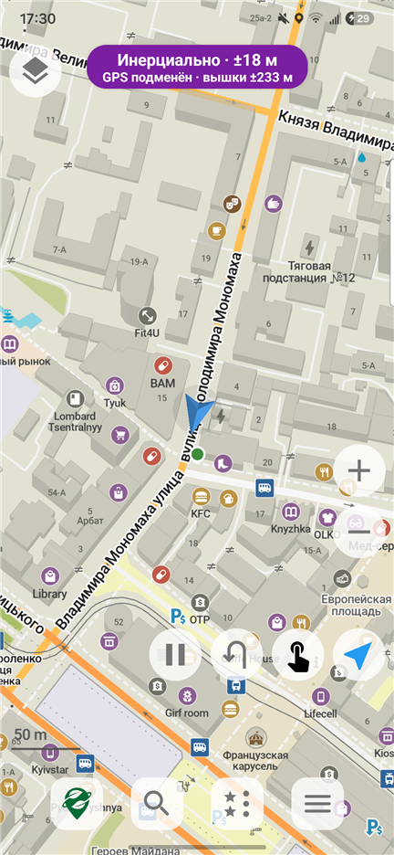
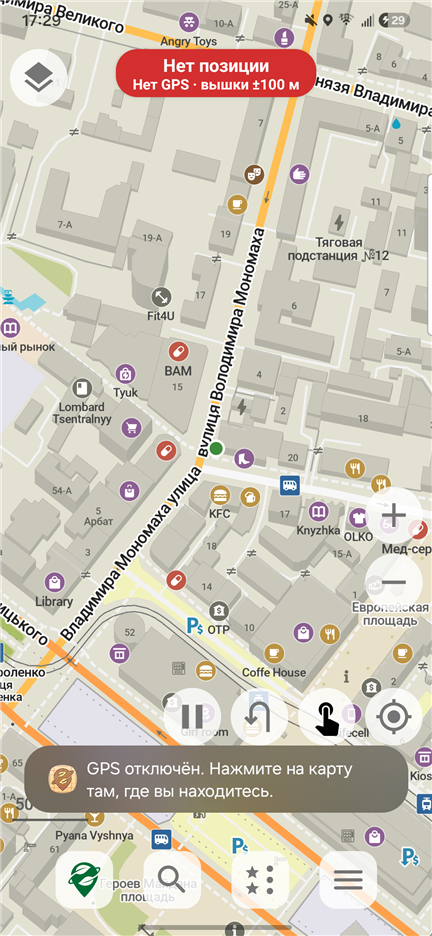
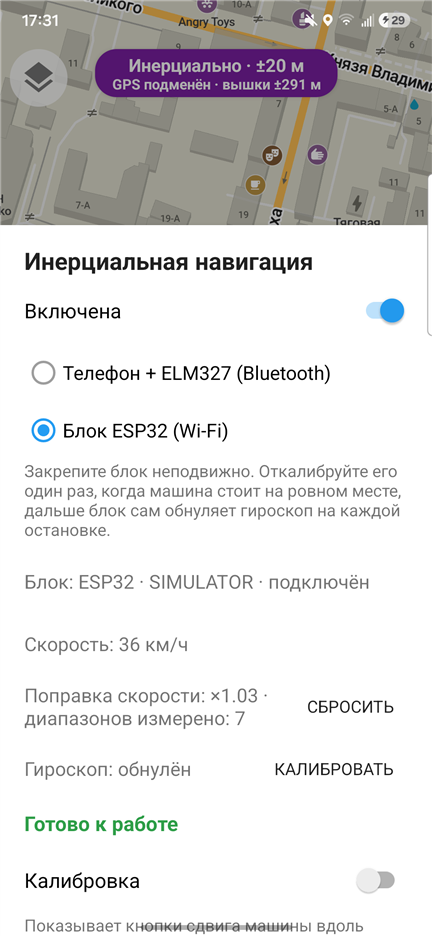

# NoGPS Maps

**Офлайн-навігація для водіїв, яка працює там, де GPS глушать або підміняють.**

NoGPS Maps — Android-застосунок на основі [Organic Maps](https://organicmaps.app) ([GitHub](https://github.com/organicmaps/organicmaps)).
Коли супутникова навігація зникає або показує машину в іншому місті, застосунок помічає це сам і веде
машину за інерціальною навігацією: повороти бере з гіроскопа, а пройдену відстань — зі швидкості
автомобіля через OBD-II.

> 🚧 **Статус: активна розробка (альфа).** Застосунок тестується в реальних поїздках по Дніпру.
> Мета — стабільний випуск у Google Play.

*English summary: an Android fork of Organic Maps for driving under GPS jamming and spoofing. It
detects spoofed positions, switches to a manual mode and keeps the car on the roads with dead
reckoning from the phone gyroscope (or an external ESP32 sensor box) and the car speed from an OBD-II
ELM327 adapter. The firmware of the sensor box: [ELMandIMU](https://github.com/Ramzess-II/ELMandIMU).*

<p align="center">
  
  
  
</p>

---

## Що вміє

### 🛰️ Захист від глушіння та підміни GPS
- Позиція GPS звіряється з позицією за вишками та Wi-Fi і з тим, як далеко машина могла проїхати.
  Підмінений GPS ігнорується, а одиночна хибна позиція за мережею не вимикає справний GPS.
- Коли GPS зникає або підмінений, застосунок сам вмикає ручний режим.
- До GPS повертається автоматично, коли той знову надійний: працює без розривів і стрибків, збігається
  з позицією машини або їде разом з машиною дорогами з тією ж швидкістю.

### 🚗 Інерціальна навігація
- **Телефон + ELM327:** гіроскоп телефона, закріпленого на панелі, і швидкість з OBD-II через
  Bluetooth-адаптер ELM327.
- **Блок ESP32 (Wi-Fi):** зовнішній блок датчиків, жорстко закріплений у машині, передає поворот і
  швидкість. Прошивка блоку — в окремому репозиторії [ELMandIMU](https://github.com/Ramzess-II/ELMandIMU),
  технічне завдання на неї і протокол: [`docs/nogps/esp32-firmware-spec.md`](docs/nogps/esp32-firmware-spec.md).
- Машина тримається доріг і маршруту: позиція прив'язується до дороги, поворот переноситься на
  перехрестя, де він справді був, а плавний вигин дороги поворотом не вважається.
- Якщо розрахунок вивів машину з доріг, позначка зупиняється на дорозі й просить відмітитися.

### 🎯 Самокалібрування
- **Таблиця поправок швидкості:** похибку спідометра OBD застосунок вимірює за надійним GPS окремо для
  кожного діапазону швидкостей (по 10 км/год). Таблиця вчиться постійно і зберігається між поїздками.
- **Гіроскоп** обнуляється на кожній зупинці. Замір застосовується, лише якщо його підтверджує наступний,
  тож рушання з місця не псує калібрування.

### ✋ Ручний режим
- Позначка ставиться дотиком до карти й лягає вздовж дороги. Напрямок береться з гіроскопа або з двох
  позначок, кнопка розвертає машину.
- Пауза руху на час маневрів: паркування, розворот у кілька прийомів.
- Маршрут перебудовується від позначки в той бік, куди їде машина.

### 🧭 Для водія
- Плашка вгорі завжди показує джерело позиції (GPS, інерціально, вручну) і її точність.
- Попередження, якщо OBD-адаптер перестав передавати швидкість.
- Тільки автомобільні маршрути, екран не гасне під час руху.
- Журнал поїздки для розбору складних випадків (у налаштуваннях, увімкнено логування).

Усе інше — офлайн-карти OpenStreetMap, пошук, маршрути, закладки — успадковано від Organic Maps.

---

## Обладнання

| Варіант | Що потрібно | Примітки |
|---|---|---|
| Телефон + ELM327 | Bluetooth-адаптер ELM327 (класичний Bluetooth), тримач на панелі | Телефон має бути закріплений нерухомо |
| Блок ESP32 | Блок з гіроскопом і швидкістю з OBD, підключення по Wi-Fi | Точніше: датчик жорстко закріплений на кузові |

---

## Збірка

Потрібні JDK 17, Android SDK та NDK (див. [docs/INSTALL.md](docs/INSTALL.md)).

```bash
git clone --recurse-submodules https://github.com/Ramzess-II/NoGPSMaps.git
cd NoGPSMaps/android
./gradlew assembleFdroidDebug -Parm64     # APK: app/build/outputs/apk/fdroid/debug/
```

Модульні тести навігації — у ядрі C++, разом із тестами Organic Maps:

```bash
cmake --preset debug -B build
cmake --build build --target map_tests
QT_QPA_PLATFORM=offscreen ./build/map_tests --filter=NoGps_
```

iOS збирається з `xcode/omim.xcworkspace`, схема `OMaps` (див. [iphone/CLAUDE.md](iphone/CLAUDE.md)). На iOS
рух машини береться тільки з блоку ESP32: iOS не дає застосункам Bluetooth SPP для адаптерів ELM327.

Карти завантажуються в самому застосунку. Код навігації без GPS спільний для Android та iOS:
- [`libs/map/nogps`](libs/map/nogps) — детектор підміни, повернення до GPS, ручний режим, інерціальна
  навігація, калібрування, протоколи ELM327 та ESP32;
- [`libs/routing`](libs/routing), [`libs/map`](libs/map) — прив'язка до доріг і маршруту;
- [`android/sdk/.../location/`](android/sdk/src/main/java/app/organicmaps/sdk/location/) та
  [`iphone/Maps/Core/NoGps/`](iphone/Maps/Core/NoGps/) — те, що залежить від платформи: позиції, датчики,
  з'єднання з адаптером і блоком.

---

## Шлях до продакшну

- [x] Власна назва та іконка, тексти застосунку називають його NoGPS Maps.
- [x] Дозвіл команди Organic Maps на використання їхніх карт і серверів (див. нижче).
- [x] Екран «Про застосунок» у головному меню з посиланнями на Organic Maps і OpenStreetMap.
- [ ] Власна колірна схема замість зеленого кольору Organic Maps.
- [x] Адреса підтримки для звітів про помилки: most05062014@gmail.com.
- [x] [Політика конфіденційності](docs/nogps/privacy-policy.md), тексти й графіка для сторінки в магазині,
      [інструкція з публікації в Google Play](docs/nogps/google-play.md).
- [x] Релізна збірка: підпис ключем із `app/secure.properties`, нативні бібліотеки вирівняні під 16 КБ.
- [x] «Поділитися» надсилає посилання openstreetmap.org, нові скриншоти для магазину.
- [ ] Закритий тест у Google Play (12 тестувальників, 14 днів).
- [ ] Зовнішній блок датчиків ESP32: [прошивка](https://github.com/Ramzess-II/ELMandIMU) в роботі, корпус,
      кріплення.
- [ ] Перевірка в поїздках: кільця, розв'язки, розвилки, затори.
- [ ] Збір звітів про збої без персональних даних.

---

## Ліцензії

NoGPS Maps — похідна робота від Organic Maps і розповсюджується на тих самих умовах.

| Що | Ліцензія | Файл |
|---|---|---|
| Вихідний код Organic Maps і наші зміни | Apache License 2.0 | [LICENSE](LICENSE), [NOTICE](NOTICE) |
| Скомпільовані дані карт (`.mwm`, `.bin`) | Окрема ліцензія Organic Maps на основі ODbL | [DATA_LICENSE.txt](DATA_LICENSE.txt) |
| Дані OpenStreetMap | Open Database License (ODbL) 1.0 | [LICENSES/ODbL-1.0.txt](LICENSES/ODbL-1.0.txt) |
| Сторонні бібліотеки | MIT, BSD, Boost, zlib та інші | [LICENSES/](LICENSES), [3party/](3party), [data/copyright.html](data/copyright.html) |

**Обов'язкова атрибуція:** «Map data © OpenStreetMap and Organic Maps» з посиланнями на
https://www.openstreetmap.org/copyright і https://organicmaps.app — на карті, в меню та в розділі
«Про застосунок». У NoGPS Maps вона є в пункті головного меню «Про застосунок · Organic Maps».

**Дозвіл Organic Maps.** Ліцензія на дані карт забороняє ребрендинг без письмового дозволу. Команда
Organic Maps (жовтень 2026) дозволила NoGPS Maps використовувати їхні карти та сервери, поки
користувачів не більше тисячі, за умови атрибуції з назвою, на яку можна натиснути, і посиланням на
проєкт у місці, видимому всім користувачам. Для більшої кількості користувачів умови треба узгодити
з ними окремо.

Organic Maps — торгова марка Organic Maps Project. NoGPS Maps — незалежний проєкт і не пов'язаний з
командою Organic Maps та не підтримується нею.

---

## Безпека

Інерціальна навігація накопичує похибку, особливо без калібрування. Звіряйтеся з дорогою і знаками,
не відволікайтеся від керування. Позначку ставте, коли це безпечно, або доручіть пасажиру.

## Подяки

Команді та спільноті [Organic Maps](https://github.com/organicmaps/organicmaps), учасникам
[OpenStreetMap](https://www.openstreetmap.org) та авторам бібліотек, на яких побудовано проєкт.
